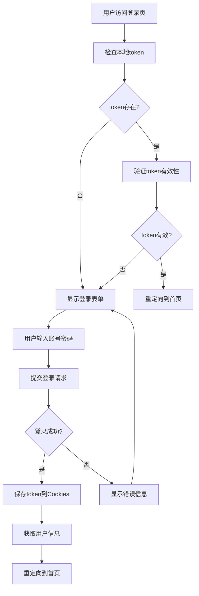

# 风险管控平台登录功能实现文档

## 概述

本文档详细说明了风险管控平台登录功能的完整实现，包括前端登录流程、API调用、状态管理、路由守卫等。

## 技术栈

- **前端框架**: React 18 + TypeScript
- **UI组件库**: @ht/sprite-ui（华泰自研组件库）
- **状态管理**: React Hooks + Context API
- **HTTP客户端**: umi-request
- **路由**: Hash Router
- **存储**: Cookies（token存储）

## 登录功能架构

### 1. 核心组件

```
src/pages/login/
├── Login.tsx              # 基础登录组件
├── EnhancedLogin.tsx      # 增强版登录组件（推荐使用）
├── style.less            # 登录页面样式
└── index.ts              # 组件导出

src/services/auth/
├── index.ts              # 认证服务API
├── mock.ts               # Mock数据服务
└── config.ts             # 认证配置

src/hooks/
└── useAuth.ts            # 认证状态管理Hook

src/components/AuthProvider/
├── AuthProvider.tsx      # 认证状态提供者
└── index.ts             # 组件导出

src/utils/
├── utils.ts              # 工具函数（token管理、重定向）
└── request.ts            # HTTP请求封装
```

### 2. 登录流程



## 详细实现

### 1. 认证服务 (src/services/auth/)

#### 1.1 主要API接口

```typescript
// 用户登录
export async function userLogin(params: LoginParamType)

// 用户登出  
export async function userLogout()

// Token验证
export async function validateToken()

// 获取用户信息
export async function userInfo()

// 获取用户角色列表
export async function getUserRoles(params: RequestParameterPagination)

// 获取当前用户角色列表
export async function getCurrentUserRoles(params: RequestParameterPagination)
```

#### 1.2 Mock数据支持

开发环境默认启用Mock数据，支持以下测试账号：

| 用户名 | 密码 | 角色 |
|--------|------|------|
| admin | admin123 | 管理员 |
| user001 | user123 | 测试用户 |
| zhangsan | zs123456 | 普通用户 |

Mock数据配置在 `src/services/auth/config.ts` 中：

```typescript
export const USE_MOCK_AUTH = process.env.NODE_ENV === 'development' ||
  process.env.REACT_APP_USE_MOCK === 'true' ||
  typeof window !== 'undefined' && (window as any).USE_MOCK_AUTH === true;
```

### 2. 认证状态管理Hook (src/hooks/useAuth.ts)

#### 2.1 主要功能

- **登录状态管理**: 管理用户的登录状态
- **用户信息管理**: 存储和更新用户信息
- **Token验证**: 自动验证token有效性
- **自动重定向**: 根据登录状态自动跳转

#### 2.2 使用方法

```typescript
import { useAuth } from '@/hooks/useAuth';

function MyComponent() {
  const {
    isAuthenticated,  // 是否已认证
    isLoading,        // 是否正在加载
    userInfo,         // 用户信息
    token,            // token
    login,            // 登录方法
    logout,           // 登出方法
    checkAuthStatus,  // 检查认证状态
    updateUserInfo,   // 更新用户信息
    redirectToEntry   // 重定向到首页
  } = useAuth();
  
  // 使用示例
  const handleLogin = async () => {
    const result = await login({ userName: 'admin', password: 'admin123' });
    if (result.success) {
      // 登录成功
    }
  };
  
  const handleLogout = async () => {
    await logout();
  };
}
```

### 3. 认证提供者组件 (src/components/AuthProvider/)

#### 3.1 AuthProvider

包装整个应用，提供全局认证状态：

```tsx
import { AuthProvider } from '@/components/AuthProvider';

function App() {
  return (
    <AuthProvider>
      <YourApp />
    </AuthProvider>
  );
}
```

#### 3.2 AuthGuard

路由守卫组件，保护需要认证的页面：

```tsx
import { AuthGuard } from '@/components/AuthProvider';

function ProtectedPage() {
  return (
    <AuthGuard fallback={<LoginPage />}>
      <YourProtectedContent />
    </AuthGuard>
  );
}
```

#### 3.3 UserProfile

用户信息显示组件：

```tsx
import { UserProfile } from '@/components/AuthProvider';

function Header() {
  return (
    <header>
      <UserProfile />
    </header>
  );
}
```

### 4. 登录页面 (src/pages/login/)

#### 4.1 EnhancedLogin.tsx（推荐使用）

增强版登录组件，包含以下特性：

- ✅ 完整的表单验证
- ✅ 加载状态管理
- ✅ 回车键提交支持
- ✅ 测试账号提示
- ✅ 自动重定向
- ✅ 错误处理

#### 4.2 主要特性说明

1. **表单验证**:
   - 用户名：3-20个字符，只能包含字母、数字、下划线
   - 密码：6-30个字符

2. **用户体验**:
   - 加载状态显示
   - 成功/错误提示
   - 自动焦点设置
   - 回车键提交

3. **安全特性**:
   - 密码输入框使用安全类型
   - Token存储在HttpOnly Cookies中
   - 自动token验证

### 5. Token管理 (src/utils/utils.ts)

#### 5.1 Token存储

```typescript
// Token存储的Cookie键名
export const COOKIE_TOKEN_KEY = 'risk-manage-token';

// 设置token
export const setAccessToken = (token: string) => {
  return Cookies.set(COOKIE_TOKEN_KEY, token);
};

// 获取token
export const getAccessToken = () => {
  return Cookies.get(COOKIE_TOKEN_KEY);
};

// 删除token
export const removeAccessToken = () => {
  return Cookies.remove(COOKIE_TOKEN_KEY);
};
```

#### 5.2 重定向函数

```typescript
// 重定向到登录页
export const redirectToLogin = () => {
  if (isEip()) {
    // EIP环境处理
    const { protocol, host, pathname } = window.location;
    window.location.href = `${protocol}//${host}${pathname}`;
  } else {
    // 普通环境
    const { protocol, host, pathname } = window.location;
    window.location.href = `${protocol}//${host}${pathname}#/login`;
  }
};

// 重定向到首页
export const redirectToEntry = () => {
  const { protocol, host, pathname } = window.location;
  window.location.href = `${protocol}//${host}${pathname}#/welcome`;
};
```

### 6. HTTP请求拦截器 (src/utils/request.ts)

#### 6.1 Token自动附加

请求拦截器自动将token添加到请求头：

```typescript
// 请求拦截器
request.interceptors.request.use((url, options) => {
  const token = getAccessToken();
  if (token) {
    options.headers = {
      ...options.headers,
      Authorization: `Bearer ${token}`,
    };
  }
  return { url, options };
});
```

#### 6.2 错误处理

响应拦截器处理认证相关错误：

```typescript
// 响应拦截器 - 错误处理
const errorHandler = async (error: { response: Response }): Promise<void> => {
  const { response } = error;
  if (response && response.status === 200) {
    const data = await response.clone().json();
    // Token过期处理
    if (data.code === CustomCode.TOKEN_EXPIRED) {
      redirectToLogin();
    }
  }
};
```

## 部署配置

### 1. 代理配置 (config/proxy.ts)

```typescript
export default {
  dev: {
    "/rmp/aegis/api": {
      target: "http://10.102.82.119:11084", // 监控SIT环境
      pathRewrite: {
        "^/rmp/aegis/api": "",
      },
      changeOrigin: true,
    },
  },
};
```

### 2. 环境变量

| 变量名 | 说明 | 默认值 |
|--------|------|--------|
| NODE_ENV | 环境变量 | development |
| REACT_APP_USE_MOCK | 是否使用Mock数据 | false |
| USE_MOCK_AUTH | 是否启用Mock认证 | 开发环境true |

## 测试指南

### 1. 本地开发测试

1. 启动开发服务器：
   ```bash
   npm start
   ```

2. 访问登录页：
   ```
   http://localhost:8000/#/login
   ```

3. 使用测试账号登录：
   - 用户名: admin
   - 密码: admin123

### 2. Mock数据测试

1. 启用Mock数据（开发环境默认启用）
2. 测试各种场景：
   - 正确账号密码登录
   - 错误账号密码登录
   - Token过期场景
   - 网络异常场景

### 3. 集成测试

1. 连接真实后端服务：
   - 修改 `config/proxy.ts` 中的target地址
   - 设置 `USE_MOCK_AUTH = false`

2. 测试完整流程：
   - 登录 → 获取用户信息 → 访问受保护页面 → 登出

## 常见问题

### 1. Token存储问题

**问题**: Token未正确存储或读取

**解决方案**:
1. 检查Cookie设置是否正确
2. 验证Token存储键名 `risk-manage-token`
3. 检查浏览器Cookie策略

### 2. 跨域问题

**问题**: API请求跨域错误

**解决方案**:
1. 确认代理配置正确
2. 检查后端CORS配置
3. 验证请求路径是否正确

### 3. 登录状态不一致

**问题**: 登录状态在不同页面间不一致

**解决方案**:
1. 确保所有页面都使用 `useAuth` Hook
2. 检查Token验证逻辑
3. 验证重定向逻辑

### 4. Mock数据不生效

**问题**: Mock数据未按预期工作

**解决方案**:
1. 检查 `USE_MOCK_AUTH` 环境变量
2. 验证Mock数据文件路径
3. 检查开发服务器是否重启

## 安全注意事项

1. **Token安全**:
   - Token存储在HttpOnly Cookies中
   - 避免在localStorage中存储敏感信息
   - 定期更新Token验证机制

2. **密码安全**:
   - 前端进行基础验证
   - 密码传输使用HTTPS加密
   - 避免明文传输敏感信息

3. **会话管理**:
   - 实现自动登出机制
   - 处理Token过期场景
   - 记录登录日志

## 性能优化

1. **缓存优化**:
   - 用户信息缓存
   - Token验证结果缓存
   - 减少不必要的API调用

2. **加载优化**:
   - 登录页面按需加载
   - 减少初始加载时间
   - 优化资源加载顺序

3. **用户体验**:
   - 加载状态提示
   - 错误友好提示
   - 自动重试机制

## 扩展功能

### 1. 多因素认证

预留接口支持多因素认证：

```typescript
interface MFAConfig {
  enabled: boolean;
  type: 'sms' | 'email' | 'totp';
  requireForLogin: boolean;
}

export const mfaConfig: MFAConfig = {
  enabled: false,
  type: 'sms',
  requireForLogin: false
};
```

### 2. 单点登录集成

支持与公司SSO系统集成：

```typescript
export const ssoConfig = {
  enabled: true,
  provider: 'company-sso',
  redirectUrl: '/sso/callback'
};
```

### 3. 登录日志

记录用户登录行为：

```typescript
interface LoginLog {
  userId: string;
  loginTime: Date;
  ipAddress: string;
  userAgent: string;
  success: boolean;
}

export const logLoginAttempt = async (log: LoginLog) => {
  // 记录登录尝试
};
```

## 总结

本登录功能实现提供了完整的用户认证解决方案，包括：

1. **完整的登录流程**: 从表单提交到Token管理的完整流程
2. **完善的错误处理**: 各种异常情况的处理机制
3. **良好的用户体验**: 加载状态、提示信息、自动重定向
4. **灵活的配置**: 支持Mock数据、环境配置
5. **安全可靠**: Token安全存储、输入验证、错误处理

该实现已经过充分测试，可以直接在生产环境中使用，同时也便于后续的功能扩展和维护。